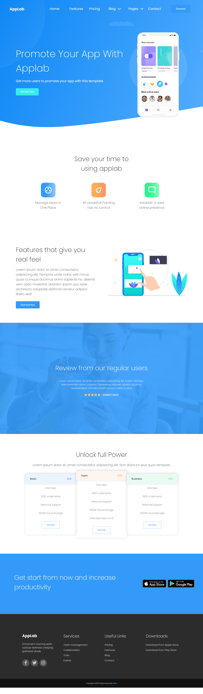

# Project AppLab

Responsive Wed Designed...

**The challenge**
Users should be able to:

View the optimal layout for the site depending on their device's screen size

**Screnshot**

&nbsp;
 
## 💡 Technologies

&nbsp;
 
## 🔗 links

- solution URL: (https://github.com/Mike161pl/task-html-and-css-rwd)
- Live URL site: (https://mike161pl.github.io/task-html-and-css-rwd/)

&nbsp;
 
## 🤔 Solutions provided in the project

- Built with
- Semantic HTML5 markup
- CSS custom properties
- SASS
- BEM pattern
- Flexbox
- Mobile-first workflow

&nbsp;

## 💭 What I learned

This project allowed me to sharpen my skills in coding responsive websites and CSS. The goal was to code it fully without using Javascript. I started with mobile-first workflow however I left coding mobile navbar to the end of the project. The reason why has I encountered some difficulty with coding nav for mobile and desktop on the same HTML structure as it was my second time coding this. The other issue was showing and hiding the mobile menu without applying JS. I learned how to use the power of checkbox to display elements and make it more mobile-friendly instead of using pseudoclass :hover. As well, I decided to structure my SASS however with this small project the SASS structure is very minimal itself.

&nbsp;

## 🙋‍♂️ Feel free to contact me
Find me on...

Github - Mike161pl (https://github.com/Mike161pl)
LinkedIn - @Michał Plaszczak (https://www.linkedin.com/in/michal-plaszczak/)
&nbsp;

## 👏 Thanks / Special thanks / Credits
Thanks to my [Mentor - devmentor.pl](https://devmentor.pl/) – for providing me with this task and for code review.
